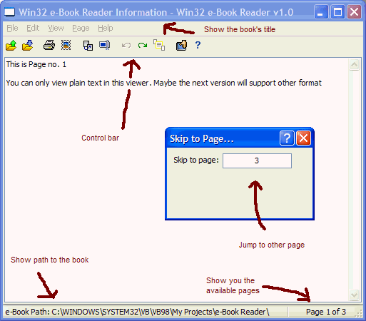



## An e\-Book Reader, like Adobe Arcobat Reader

### Description

A 30 minutes e-book reading program to replace Adobe Acrobat Reader. This is a simple one. Thanks to J. Kelly Jr. for his GREAT File Binder submission.
 
### More Info
 

             |
---                |---
**Submitted On**   |2003-01-24 12:16:20
**By**             |[Shukri Zahari](https://github.com/Planet-Source-Code/PSCIndex/blob/master/ByAuthor/shukri-zahari.md)
**Level**          |Intermediate
**User Rating**    |3.8 (23 globes from 6 users)
**Compatibility**  |VB 5\.0, VB 6\.0
**Category**       |[Files/ File Controls/ Input/ Output](https://github.com/Planet-Source-Code/PSCIndex/blob/master/ByCategory/files-file-controls-input-output__1-3.md)
**World**          |[Visual Basic](https://github.com/Planet-Source-Code/PSCIndex/blob/master/ByWorld/visual-basic.md)
**Archive File**   |[An\_e\-Book\_156727412003\.zip](https://github.com/Planet-Source-Code/shukri-zahari-an-e-book-reader-like-adobe-arcobat-reader__1-44401/archive/master.zip)

